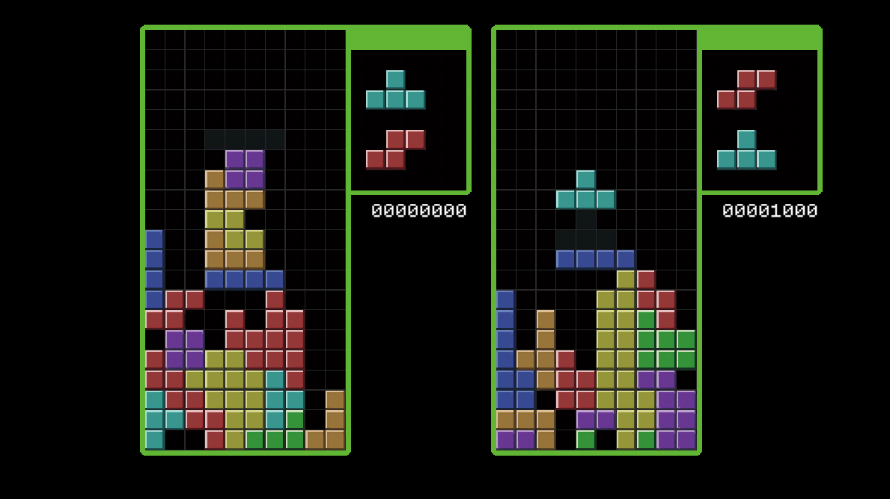

# LineDeleteGame

<p align="center">
    
</p>

**[日本語](README.ja.md)**

## Abstract 

This is my practice of real-time networking game delopment.
This README describe how to reproduce my game development environment on your computers.

## Developing Environments

### OS

* any platforms
  * I've launched this game on Windows, Mac
  * I've also launched server on Windows, Mac, and AWS EC2.
* Main developing environments are Visual Studio 2019 or VSCode.

### You need prepare

* Unity / 2020.2.2f1
* Docker and Docker compose

### Dependency Libraries include this repository

* MagicOnion / 4.1.2
* MessagePack.Unity / 2.1.12
* UniTask / 2.1.2
* LogicLooper / 1.0.2

## How to setup

### Clone this repository

```console
# clone this repostory
$ git clone git@github.com:y-tomita/UnityGames.git

# move to LineDeleteGame directory
$ cd LineDeleteGame
```

### Download and set gRPC Libraries to Plugins Directory

You must download plugins from [gRPC packages page](https://packages.grpc.io/archive/2019/08/e14154481baf7e23710b60b78a1e91299985ec80-41fb322e-6416-4509-9a6f-2b17085b6272/index.xml) and unpack "grpc_unity_package.2.23.0-dev.zip".
Next, you have to place just these directories to "LineDeleteGame/Assets/Plugins" directory.

* Google.Protobuf
* Grpc.Core
* Grpc.Core.Api

## Boot Unity and play offline game

You can just launch offline game mode.

Launch your Unity 2020.2.2f1 and boot LineDeleteGame UnityProject. You select "Assets/Scenes/BlockGameMain.unity" on your UnityEditor and you can see my game title view when you play UnityEditor. You can play offline game if you press up arrow key!

## Launching localhost on Visual Studio

You can integrate .Net core hosting project into UnityProject's solutions.
First, you select any csharp scripts on your UnityEditor, and double click to launch Visual Studio.
Second, you do right click your solutions on your solutions explorer, and add these csproj into your solutions.

* "LineDeleteGame/App.Server/App.Server.csproj"
* "LineDeleteGame/App.Shared/App.Shared.csproj"

Third, you do right click your App.Server project on your solutions explorer, and select "set start up project".
Finally you select "Start Debugging" and execute this project, you can launch .Net Core hosting server as localhost.

You can connect this localhost server from your UnityEditor. 
Please edit "GRPC_CONNECT_ADDRESS " variable on "LineDeleteGame/Assets/Scripts/App/Server/Shared/Common/SharedConstant.cs" to "http://localhost:5001" or your PC's local IP address.

## Launching .Net core hosting on Docker containers

You can also launch this server on Docker containers.

### Setup Docker and Docker-compose

Please setup Docker and Docker-compose package yourself following your OS installing instructions.

### Create your cert file

It is necessary to create your cert file anywhere you want.
Please see [Generate self-signed certificates with the .NET CLI](https://docs.microsoft.com/en-us/dotnet/core/additional-tools/self-signed-certificates-guide#with-openssl) document how to create your cert file.

### Copy and edit ".env" file

Copy "LineDeleteGame/sample.env" to "LineDeleteGame/.env" to your project.
And you have to modify these variables to your cert files path or password.

```console
CERT_PATH=your_cert_path
CERT_PASSWORD=your_cert_password
```

### Launch Container

I've prepared docker-compose file, so you only have to execute docker-compose command if you launch container as .Net Core hosting server.

```console
$ cd UnityGames/LineDeleteGame

# build container
$ docker-compose build

# launch container
$ docker-compose up -d
```

Then you can connect this container using your PC's IP address.